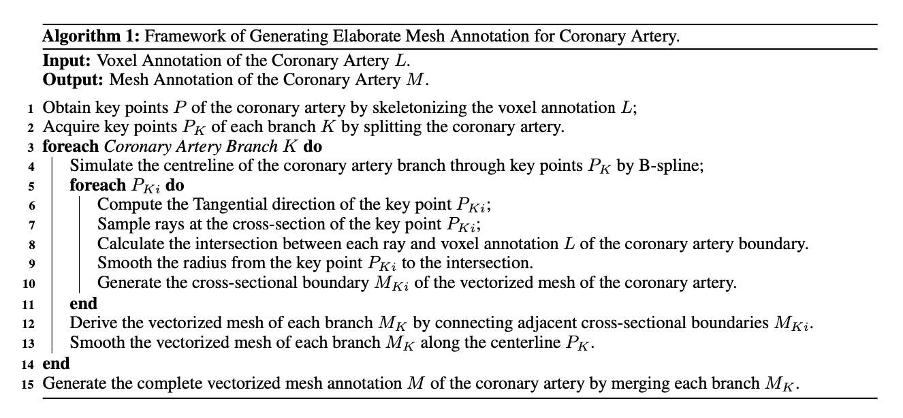

# Segmentation and Vascular Vectorization for Coronary Artery by Geometry-based Cascaded Neural Network


## Abstract

Segmentation of the coronary artery, angiography (CCTA). geometry-based segmentation network. 
## Network


> Fig.1  geometry-based cascaded segmentation network for generating mesh of the coronary artery.



> Fig.1  Fine Mesh Annotation for Geometrical Regularization

## Graph Convolutional Network
Graph Convolutional Network: a sphere mesh $\mathcal{G}=\{\mathcal{V}, \mathcal{E}\}$ with 162 vertices and 480 edges is initialized as the input of the GCN, where $\mathcal{V}$ denotes the set of vertices and $\mathcal{E}$ represents the set of edges. The mesh with $N$ vertices $v_i \in \mathcal{V}$ in the GCN has its adjacency matrix $\mathbf{A} \in \mathbb{R}^{N \times N}$ and diagonal degree
$\hat{\mathbf{D}}_{i i}=\sum_{j=0} \hat{\mathbf{A}}_{i j}$, where $\hat{\mathbf{A}}=\mathbf{A}+\mathbf{I}$. The graph convolution is executed as Eq. 1.

$$
\mathbf{V}^{\prime}=\hat{\mathbf{D}}^{-1 / 2} \hat{\mathbf{A}} \hat{\mathbf{D}}^{-1 / 2} \mathbf{V} \Theta
$$

where $\Theta$ represents the parameters of the neural network and $\mathbf{V} \in \mathbb{R}^{N \times C}$ symbolizes the feature vector with $C$ dimension for each node $v_i$. In addition, the residual block is applied to predict the deformation of the mesh instead of predicting the vertices location of the target mesh directly, which simplifies the difficulty of training. Furthermore, the initial sphere is easily deformed but lacks enough details of the coronary artery. Graph unpooling is implemented in our GCN at stage I, dividing one triangular face into four parts along the midpoint of each side and assigning the mean feature vector of one edge to the node of the midpoint. It supplements more vertices and edges, retouching the mesh of the coronary artery. The LNS [24] strategy is performed to project extracted image features into the mesh space.


## Optimization of Segmentation Network: 
Optimization of Segmentation Network: For jointly training the U-shape neural networks and GCN, various loss functions are adopted to optimize them. First, image loss is mainly driving the U-shape network under the voxel-based segmentation framework, consisting of SoftDice loss and cross-entropy loss. Second, mesh loss optimizes the GCN, including chamfer distance loss, laplacian smoothing, normal consistency loss and edge loss. The chamfer distance dominates the optimization of the GCN, which measures the distance of two point clouds between the prediction and ground truth as Eq.2, guiding the deformation of the mesh.

$$
\begin{aligned}
\mathcal{L}_{C D}\left(\mathcal{V}_1, \mathcal{V}_2\right) & =\frac{1}{\left|\mathcal{V}_1\right|} \sum_{x \in \mathcal{V}_1} \min _{y \in \mathcal{V}_2}\|x-y\|_2^2 \\
& +\frac{1}{\left|\mathcal{V}_2\right|} \sum_{y \in \mathcal{V}_2} \min _{x \in \mathcal{V}_1}\|x-y\|_2^2
\end{aligned}
$$


Laplacian smoothing (Lap) and normal consistency loss (NC) are utilized to regularize the smoothness of the mesh. Laplacian smoothing $\mathcal{L}_{\text {Lap }}$ computes the uniform weights of all edges connected at a vertex. Normal consistency loss computes the angle of the normal $n_0$ and $n_1$ for each pair of neighboring faces as Eq. 3 .

$$
\mathcal{L}_{N C}=\sum_{e \in \mathcal{E}} 1-\cos \left(n_0, n_1\right)
$$


Besides, edge loss $\mathcal{L}_{E G}$ computes the length of each edge, avoiding outlier vertices. In summary, the total loss of the GCN is shown in Eq. 4.

$$
\mathcal{L}_{G C N}=\lambda_1 \mathcal{L}_{C D}+\lambda_2 \mathcal{L}_{\text {Lap }}+\lambda_3 \mathcal{L}_{N C}+\lambda_4 \mathcal{L}_{E G}
$$

\section*{Optimization of Segmentation Network}

To jointly train the U-shape neural networks and the Graph Convolutional Network (GCN), various loss functions are adopted to optimize the corresponding objectives.

\begin{itemize}
    \item \textbf{Image loss} drives the U-shape voxel-based segmentation network. It combines the SoftDice loss and the cross-entropy loss to encourage accurate segmentation in the voxel space.
    
    \item \textbf{Mesh loss} optimizes the GCN using the following components:
    \begin{itemize}
        \item Chamfer Distance Loss
        \item Laplacian Smoothing Loss
        \item Normal Consistency Loss
        \item Edge Length Loss
    \end{itemize}
\end{itemize}

Chamfer Distance Loss dominates the optimization of the GCN. It measures the bidirectional distance between two point clouds---the predicted and ground-truth vertex sets---as:

\[
\mathcal{L}_{CD}(\mathcal{V}_1, \mathcal{V}_2) = \frac{1}{|\mathcal{V}_1|} \sum_{x \in \mathcal{V}_1} \min_{y \in \mathcal{V}_2} \|x - y\|_2^2 
+ \frac{1}{|\mathcal{V}_2|} \sum_{y \in \mathcal{V}_2} \min_{x \in \mathcal{V}_1} \|x - y\|_2^2
\]

Laplacian Smoothing Loss \( \mathcal{L}_{\text{Lap}} \) regularizes the smoothness of the mesh by penalizing vertex deviations from the mean of their neighbors.

Normal Consistency Loss ensures that adjacent faces maintain similar normals, which encourages surface smoothness. It is defined as:

\[
\mathcal{L}_{NC} = \sum_{e \in \mathcal{E}} \left( 1 - \cos(n_0, n_1) \right)
\]

Edge Loss \( \mathcal{L}_{EG} \) penalizes the lengths of edges to prevent outlier vertices and overly stretched faces.

The total GCN loss function is:

\[
\mathcal{L}_{GCN} = \lambda_1 \mathcal{L}_{CD} + \lambda_2 \mathcal{L}_{\text{Lap}} + \lambda_3 \mathcal{L}_{NC} + \lambda_4 \mathcal{L}_{EG}
\]

This multi-component loss design ensures that the network produces both accurate voxel-level segmentations and geometrically coherent mesh outputs.


## Installation

PyTorch == 1.11.0

Python == 3.9.12

torch-geometric == 2.1.0

pytorch3d == 0.7.0

pyvista == 0.36.1

trimesh == 3.12.6

## Experiments

train on stage I:

```bash
nohup python -u ./train.py -c "./config/config-s1-train.yaml" > train-s1.log 2>&1 &
```

train on stage II:

```bash
nohup python -u ./train.py -c "./config/config-s2-train.yaml" > train-s2.log 2>&1 &
```

predict:

```bash
nohup python -u ./predict.py -c "./config/config-predict.yaml" > predict.log 2>&1 &
```
