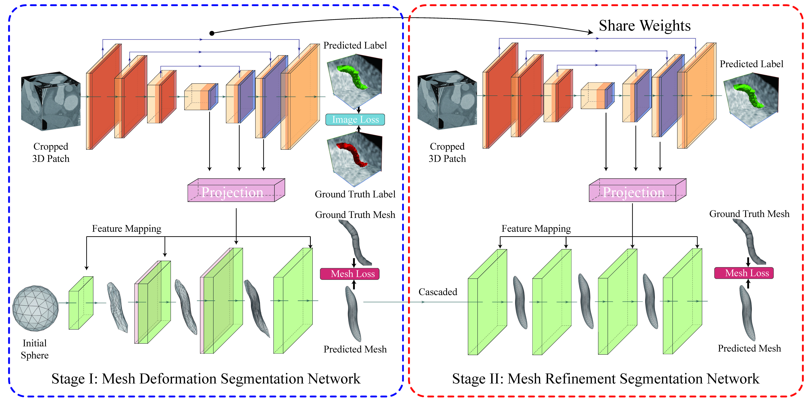

# Segmentation and Vascular Vectorization for Coronary Artery by Geometry-based Cascaded Neural Network


## Abstract

Segmentation of the coronary artery, angiography (CCTA). geometry-based segmentation network. 
## Network



> Fig.1  geometry-based cascaded segmentation network for generating mesh of the coronary artery.


> Fig.1  Fine Mesh Annotation for Geometrical Regularization

## Graph Convolutional Network
Graph Convolutional Network: a sphere mesh $\mathcal{G}=\{\mathcal{V}, \mathcal{E}\}$ with 162 vertices and 480 edges is initialized as the input of the GCN, where $\mathcal{V}$ denotes the set of vertices and $\mathcal{E}$ represents the set of edges. The mesh with $N$ vertices $v_i \in \mathcal{V}$ in the GCN has its adjacency matrix $\mathbf{A} \in \mathbb{R}^{N \times N}$ and diagonal degree $\hat{\mathbf{D}}_{i i}=\sum_{j=0} \hat{\mathbf{A}}_{i j}$, where $\hat{\mathbf{A}}=\mathbf{A}+\mathbf{I}$. The graph convolution is executed as Eq. 1.

$$
\mathbf{V}^{\prime}=\hat{\mathbf{D}}^{-1 / 2} \hat{\mathbf{A}} \hat{\mathbf{D}}^{-1 / 2} \mathbf{V} \Theta
$$

where $\Theta$ represents the parameters of the neural network and $\mathbf{V} \in \mathbb{R}^{N \times C}$ symbolizes the feature vector with $C$ dimension for each node $v_i$. In addition, the residual block is applied to predict the deformation of the mesh instead of predicting the vertices location of the target mesh directly, which simplifies the difficulty of training. Furthermore, the initial sphere is easily deformed but lacks enough details of the coronary artery. Graph unpooling is implemented in our GCN at stage I, dividing one triangular face into four parts along the midpoint of each side and assigning the mean feature vector of one edge to the node of the midpoint. It supplements more vertices and edges, retouching the mesh of the coronary artery. The LNS [24] strategy is performed to project extracted image features into the mesh space.

## Installation

PyTorch == 1.11.0

Python == 3.9.12

torch-geometric == 2.1.0

pytorch3d == 0.7.0

pyvista == 0.36.1

trimesh == 3.12.6

## Experiments

train on stage I:

```bash
nohup python -u ./train.py -c "./config/config-s1-train.yaml" > train-s1.log 2>&1 &
```

train on stage II:

```bash
nohup python -u ./train.py -c "./config/config-s2-train.yaml" > train-s2.log 2>&1 &
```

predict:

```bash
nohup python -u ./predict.py -c "./config/config-predict.yaml" > predict.log 2>&1 &
```
